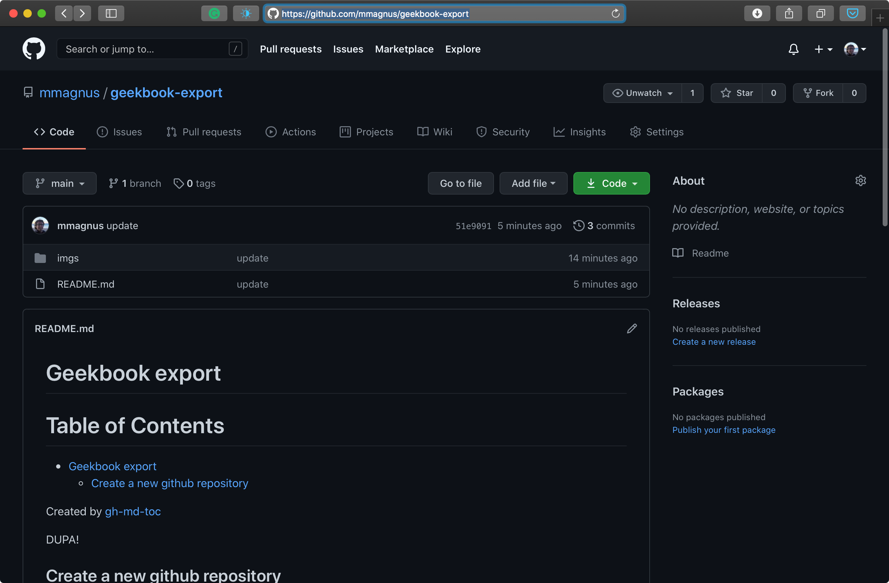

# Geekbook export
Table of Contents
=================

* [Geekbook export](#geekbook-export)
  * [Create a new github repository](#create-a-new-github-repository)
  * [page\.py](#pagepy)

Created by [gh-md-toc](https://github.com/ekalinin/github-markdown-toc.go)



## Create a new github repository
Go to https://github.com/new and type a name of your new repository, e.g., geekbook-export (you can make it public if you want, but then everyone can see your export, so mind that).

Go to a place where you want to keep your repo (/Users/magnus/Desktop/) and run

	(py37) [mx] Desktop$ git clone git@github.com:mmagnus/geekbook-export.git
	Cloning into 'geekbook-export'...
	warning: You appear to have cloned an empty repository.

Now, go to `geekbook/engine` and run  `page.py`:

	python page.py /Users/magnus/Desktop/geekbook-export geekbook-export.md --add-toc --push

You should see something like this:

```
(py37) [mx] engine$ git:(master) ✗      python page.py /Users/magnus/Desktop/geekbook-export geekbook-export.md --add-toc --push
2021-02-08 18:13:57,577 - page.py - compiling --> geekbook-export.md
# Geekbook export
Table of Contents
=================

* [Geekbook export](#geekbook-export)
  * [Create a new github repository](#create-a-new-github-repository)
  * [page\.py](#pagepy)

Created by [gh-md-toc](https://github.com/ekalinin/github-markdown-toc.go)

## Create a new github repository
Go to https://github.com/new and type a name of your new repository, e.g., geekbook-export (you can make it public if you want, but then everyone can see your export, so mind that).

Go to a place where you want to keep your repo (/Users/magnus/Desktop/) and run

	(py37) [mx] Desktop$ git clone git@github.com:mmagnus/geekbook-export.git
	Cloning into 'geekbook-export'...
	warning: You appear to have cloned an empty repository.

Now, go to `geekbook/engine` and run  `page.py`:

	python page.py /Users/magnus/Desktop/geekbook-export geekbook-export.md --add-toc --push


True
Table of Contents
=================

* [Geekbook export](#geekbook-export)
  * [Create a new github repository](#create-a-new-github-repository)

Created by [gh-md-toc](https://github.com/ekalinin/github-markdown-toc.go)
Push ...
```

## page.py

```
(py37) [mx] engine$ git:(master) ✗ python page.py --help
usage: page.py [-h] [--add-toc] [--push] exportto file

Page - one note is a page.

Example::

      (py37) [mx] engine$ git:(master) ✗ python page.py /Users/magnus/Desktop/geekbook-export geekbook-export.md --add-toc --push

positional arguments:
  exportto    a path to repo to export to
  file

optional arguments:
  -h, --help  show this help message and exit
  --add-toc   replace Table of Contents
=================

* [Geekbook export](#geekbook-export)
  * [Create a new github repository](#create-a-new-github-repository)
  * [page\.py](#pagepy)

Created by [gh-md-toc](https://github.com/ekalinin/github-markdown-toc.go) of your note with TOC generated with
              https://github.com/ekalinin/github-markdown-toc.go, make sure
              that this tool is seen in your PATH
  --push      run cd <path> && git add README.md; git add imgs/* && git commit
              -m 'update' && git push
```
